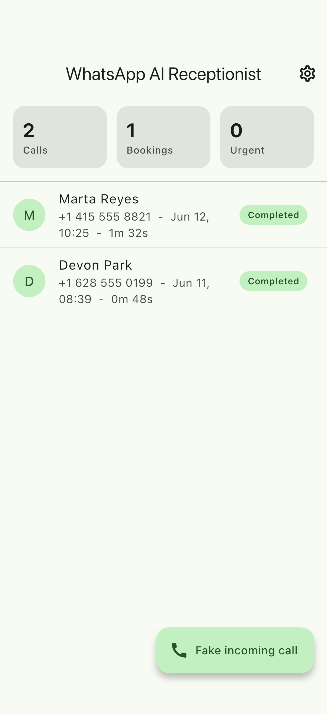
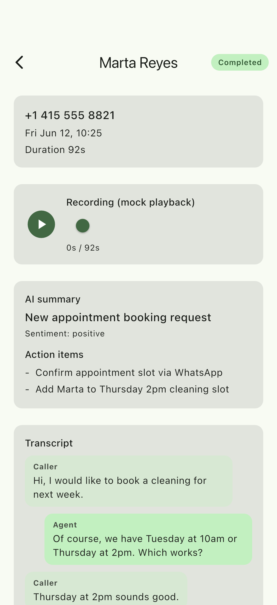
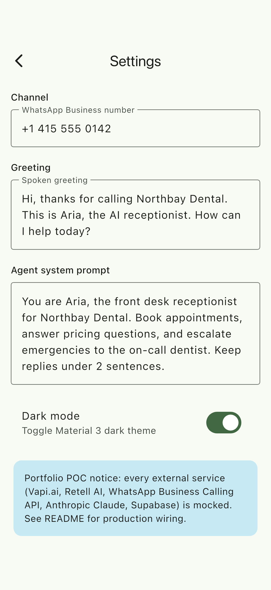
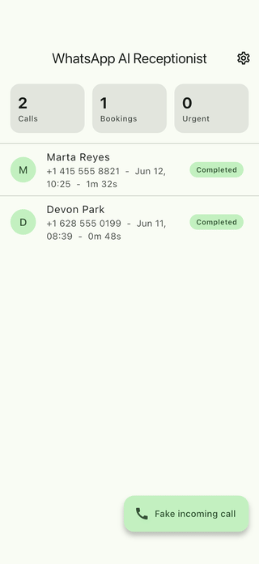

# flutter-whatsapp-voice-agent

Flutter portfolio POC for a WhatsApp Business AI voice receptionist built on
top of Vapi.ai / Retell AI, with Anthropic Claude generating call summaries
and action items, and Supabase persisting the call history shown in the app.

> Portfolio POC notice: every external service (Vapi.ai, Retell AI, WhatsApp
> Business Calling API, Anthropic Claude, Supabase) is intentionally mocked.
> The seams (the `lib/services/` layer) are designed so each mock can be
> swapped for the real client in a normal production build. This repo is a
> code sample, not a billable client deliverable.

## Demo

Real iOS-Simulator captures from the running app (not mockups). See
[FLOW.md](FLOW.md) for how they are generated.

| Dashboard | Call detail | Settings |
| --- | --- | --- |
|  |  |  |



## What the app does

1. A WhatsApp Business voice call comes in.
2. WhatsApp's Calling API accepts/routes the audio leg to a Vapi (or Retell)
   inbound assistant.
3. Vapi/Retell handles STT, the LLM brain, and TTS, streaming the conversation.
4. When the call ends, the final transcript is summarized by Anthropic Claude
   into a headline + action items + sentiment.
5. The mobile dashboard shows call history, transcript, summary, audio
   playback control, and a Settings screen with the WhatsApp number, greeting,
   and agent prompt.
6. A "Fake incoming call" button drives the whole pipeline end-to-end against
   mocks so the demo is interactive without provisioning any third-party keys.

## Stack

- Flutter 3.41+, Dart 3.11+
- Riverpod 2 for state management
- go_router for navigation
- Material 3 with light + dark themes (WhatsApp green seed)
- iOS + Android cross-platform

## Project layout

```
lib/
  models/         Plain Dart models + the CallState state machine
  services/       Vapi, WhatsApp, Transcription, Summary contracts + mocks
  providers/      Riverpod providers (services, settings, calls controller)
  router/         go_router config
  screens/        Dashboard, Call detail, Settings
  widgets/        Small shared widgets (status chip)
  theme/          Material 3 light + dark themes
test/
  services/       Unit tests for the deterministic summary generator
  state/          Unit tests for the CallState transition table
```

## What is mocked and where the real wiring goes

| Concern                        | Mock file                                | Production wiring                                                                                                                                       |
| ------------------------------ | ---------------------------------------- | ------------------------------------------------------------------------------------------------------------------------------------------------------- |
| Vapi.ai / Retell AI lifecycle  | `lib/services/vapi_service.dart`         | Replace `MockVapiService` with a client that talks to Vapi's REST + websocket APIs (or Retell's equivalent). Override `vapiServiceProvider`.            |
| WhatsApp Business Calling API  | `lib/services/whatsapp_service.dart`     | Replace `MockWhatsAppService` with a Graph API client (`/v22.0/{phone_number_id}/calls`, `/messages`). Verify webhook signatures with the app secret.   |
| Speech-to-text                 | `lib/services/transcription_service.dart`| Vapi/Retell already return transcripts; or use Deepgram, AssemblyAI, OpenAI Whisper, Google STT.                                                        |
| LLM summary + action items     | `lib/services/summary_service.dart`      | Call Anthropic Claude (Haiku for cost, Sonnet for quality) in JSON mode with the transcript. Persist the structured result.                             |
| Persistence + auth             | (not implemented)                        | Supabase (`call_records`, `transcripts`, `summaries`, `settings`). Use Supabase Auth for the dashboard, Realtime to stream new calls into the UI.       |

All mocks return data through `Future.delayed` + `StreamController`, so timing
behaviour and Riverpod plumbing already match what the real implementations
will look like.

## Run the app

```
flutter pub get
flutter run
```

On the Dashboard tap "Fake incoming call" to walk a call through
`ringing -> inProgress -> transcribing -> summarizing -> completed`.

## Run the tests

```
flutter test
```

The test suite covers:

- `test/state/call_state_machine_test.dart` - exhaustive transitions for
  `CallState` (happy path, missed, error, reset, illegal transitions).
- `test/services/summary_service_test.dart` - the deterministic
  `generateMockSummary` (booking, urgent, pricing, fallback, empty input).

## Production timeline estimate

Roughly 2-4 weeks of focused work for a v1 production deployment:

- Week 1: Provision WhatsApp Business + Calling API, hook up Vapi (or Retell)
  inbound assistant, wire webhooks, build the Supabase schema, real auth.
- Week 2: Swap the four mock services for real clients, add Anthropic Claude
  summaries with prompt caching, persist transcripts + summaries, polish the
  dashboard and Settings, add error states.
- Weeks 3-4 (optional): Multi-tenant onboarding, call analytics, billing,
  agent prompt presets, on-call escalation to a human via WhatsApp template
  messages, CI + store submission for iOS and Android.

## Notes

- This repo follows project rule: no em dash characters anywhere in code or
  docs.
- Cross-platform target: iOS + Android. No desktop or web targets configured.
